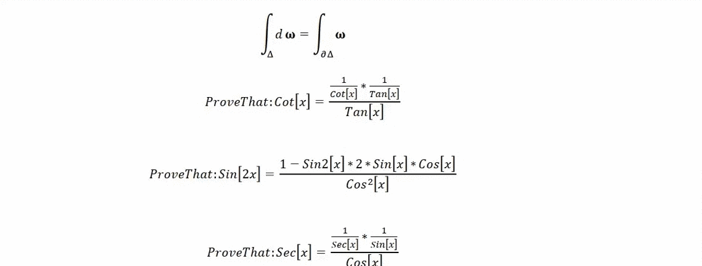

# SchoolBook

ACHIEVED SO FAR

AI-Framework capable of generating questions and answers specific to any Mathematical syllabus up to First Year University

None of the questions or answers are pre-stored, if a question exists that has an answer, our AI-Framework is capable of generating it.

Delegate questions to any number of registered students.

Obtain student specific statistics on topics covered with indicators of level of understanding down to the sub-syllabus.

Enable ease of marking per student by having the answer alongside the questions generated.

Auto suggest books and YouTube Videos for the purpose of learning.

## Getting Started

These instructions will get you a copy of the project up and running on your local machine for development and testing purposes. See deployment for notes on how to deploy the project on a live system.

### Prerequisites

.NET Version 4.6 and compatible Visual Studio.

### Installing

Visit: https://github.com/ActuarialIntelligence/SchoolBook and clone the repository as follows:

https://youtu.be/Pw0NjGan1bw

## Built With

Visual Studio 2017 Community Edition.

## Versioning

We use Git/GitExtensions combination for versioning.

## Authors

Rajah Iyer, Jyothiniranjan Pillay
https://www.researchgate.net/profile/Rajah_Iyer
https://www.linkedin.com/in/rajah-iyer-628689168/

## License

This project is licensed under the GPL3 License - see the [LICENSE.md](LICENSE.md) file for details

## Acknowledgments

HAL
Research Gate

